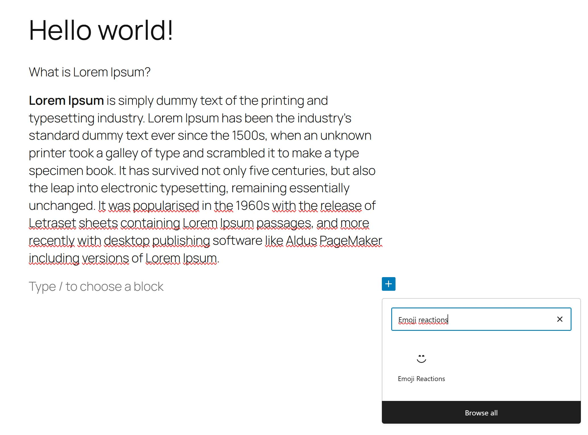
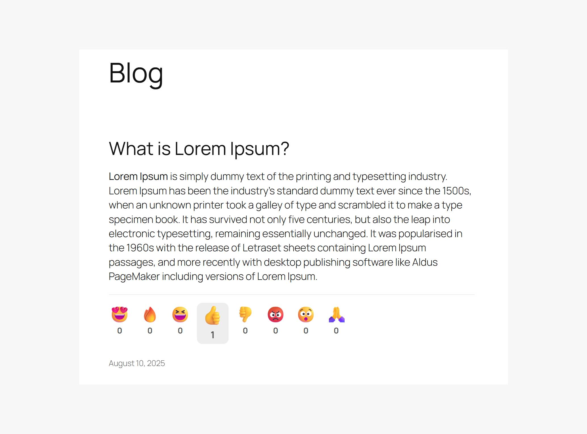
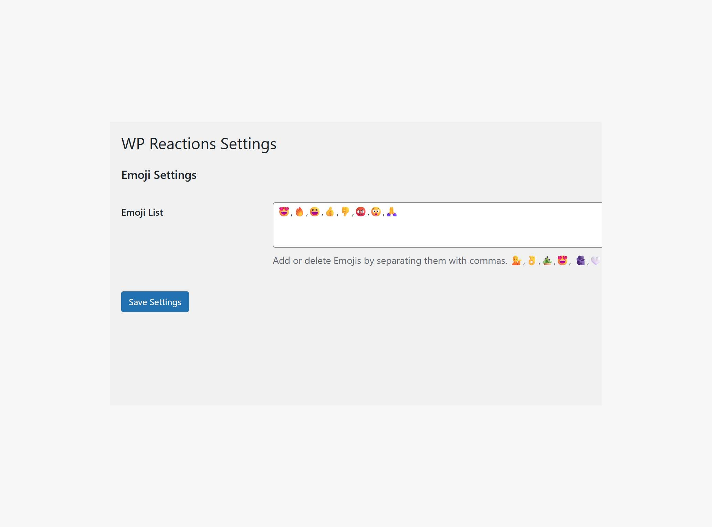

# Emoji Reactions Gutenberg

**Contributors:** mabaci  
**Tags:** emoji, reactions, gutenberg, block, feedback  
**Requires at least:** 5.8  
**Tested up to:** 6.5  
**Requires PHP:** 7.2  
**Stable tag:** 1.0.0  
**License:** GPL-2.0-or-later  
**License URI:** [https://www.gnu.org/licenses/gpl-2.0.html](https://www.gnu.org/licenses/gpl-2.0.html)

A simple Gutenberg block that adds emoji reactions to your WordPress posts or pages.  
Each emoji has its own counter, and users can vote only once per post (IP or cookie-based restriction).  

---

## Description

**Emoji Reactions Gutenberg** is a lightweight and interactive plugin that lets your visitors express their feelings quickly with emojis without leaving a comment.  
Perfect for quick feedback and engagement tracking.

**Features:**
- 🎯 Eight default emojis: `😍 🔥 😆 👍 👎 😡 😯 🙏`
- 📊 Independent counter for each emoji
- 🔒 One-click voting with IP/Cookie restriction
- ⚙️ Customizable emojis via **Settings → WP Reactions**
- 🧩 Fully integrated with the Gutenberg Block Editor
- 🖥 Works on both desktop and mobile devices

---

## Installation

1. **Download** the plugin ZIP file.
2. In your WordPress admin dashboard, go to **Plugins → Add New**.
3. Click **Upload Plugin**, select the ZIP file, and click **Install Now**.
4. Activate the plugin.

---

## Settings

1. Navigate to **Settings → WP Reactions**.
2. Update the emojis according to your preferences.
3. Save the changes.

---

## Adding the Reactions Block

1. Edit any post or page using the **Block Editor** (Gutenberg).
2. Click the ➕ **Add Block** icon.
3. Search for **"Reactions Emoji"**.
4. Insert the block anywhere in your content (commonly at the end of posts).
5. Update or publish the post.

---

## Screenshots

1. **Block Search** – Adding the *Reactions Emoji* block in Gutenberg.  
     

2. **Frontend View** – Emojis with independent counters displayed at the end of a post.  
     

3. **Settings Page** – Customizing your emoji list in the admin panel.  
     

---

## Frequently Asked Questions

**Q:** Can I change the emojis?  
**A:** Yes, you can update them in **Settings → WP Reactions**.

**Q:** Can a user vote more than once?  
**A:** No. The plugin uses IP or cookies to prevent multiple votes for the same post.

**Q:** Does it work with the Classic Editor?  
**A:** No, this plugin is designed for the Gutenberg editor only.

---

## Changelog

### 1.0.0
- Initial release.

---

## License

This plugin is licensed under the **GNU General Public License v2.0 or later**.  
You are free to use, modify, and distribute this plugin, provided you retain the license information.  
Full license text: [https://www.gnu.org/licenses/gpl-2.0.html](https://www.gnu.org/licenses/gpl-2.0.html)

---

## Disclaimer

This software is provided **"as-is"** without any warranty, express or implied.  
The author is not responsible for any damage, data loss, or other issues caused by the use of this plugin.  
Use at your own risk.

